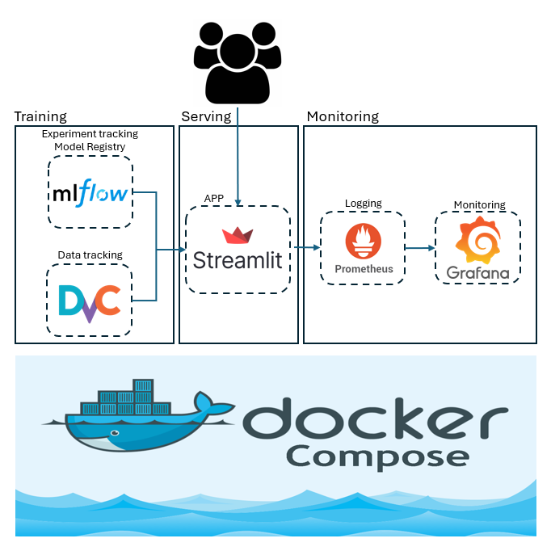
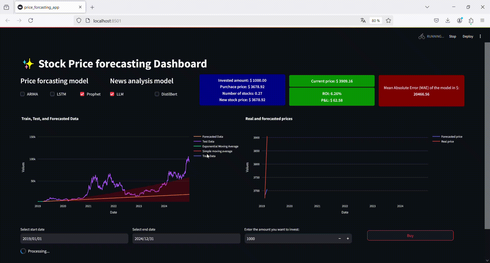

# Development of a real time price forecasting dashboard using Prophet and news sentiment analysis with LLM
Data scientist | [Anass MAJJI](https://www.linkedin.com/in/anass-majji-729773157/)
***

## :monocle_face: Description
<p align="center">
  
</p>
- This project combines both real-time and historical stock price data with news sentiment analysis to provide more accurate price forecasts and analyze market trends. The sentiment analysis is performed using models like DistilBERT or a quantized version of LLaMA with 1 billion paramters, which analyze stock related news and generate sentiment scores. These sentiment scores are then integrated into one of the price forecasting models such as ARIMA, LSTM, and Prophet.

- By incorporating sentiment analysis as an additional feature, the models can take into account external factors (news sentiment) that may influence stock's future price movements. 

- The user can select : 
    - News sentiment analysis model: DistilBert or a quantized version of LLaMA with 1B paramters.
    - Price forcasting model such as ARIMA, LSTM or PROPHET.

The data for both historical and real time prices is fetched using the YFinance and NewsApi API.

## 🚀 Getting Started 
1. Clone the repository
```bash
git clone https://github.com/your-username/stock-price-forecasting-sentiment-analysis.git
cd stock-price-forecasting-sentiment-analysis
```

2. Create a virtual environment 
```bash
python -m venv venv
source venv/bin/activate 
```

3. Install required dependencies
```bash
pip install -r requirements.txt
```

4. Run the Streamlit Dashboard
```bash
streamlit run app.py
```

## :fire: Demo of the Dashboard



## Contributing 🤝

Contributions to this project are welcome! Feel free to submit issues or pull requests for improvements.

## :mailbox_closed: Contact
For any information, feedback or questions, please [contact me][anass-email]